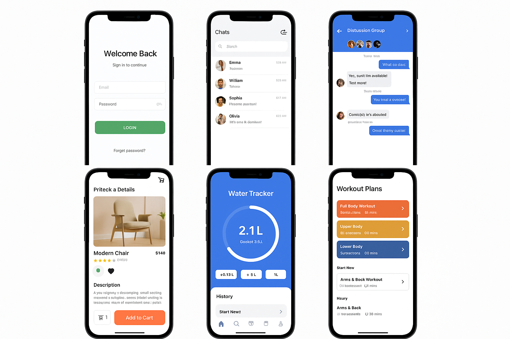

# Flutter Social Chat App

## 📷 Screenshots

This is a real-time chat application built using Flutter, Firebase, and the Stream Chat SDK. It supports 1-on-1 and group messaging, showcasing my ability to build scalable, real-world mobile apps.

## 🚀 Features
- Firebase Authentication (Email/Phone)
- One-on-one and group chats
- Online/offline presence
- Media sharing
- Stream Chat SDK
- Beautiful responsive UI (iOS & Android)
- MVVM architecture + BLoC

## 🔧 Tech Stack
- Flutter (Dart)
- Firebase
- Stream Chat SDK
- BLoC
- Responsive UI

## 💼 My Role
This project is based on a public template, but I’ve customized it to demonstrate:
- Real-time messaging logic
- Authentication integration
- Advanced UI structuring
- Portfolio-quality mobile app structure

## 📬 Contact Me
Hire me for custom mobile apps:  
👉 [https://www.fiverr.com/ugaffar](https://www.fiverr.com/ugaffar)
